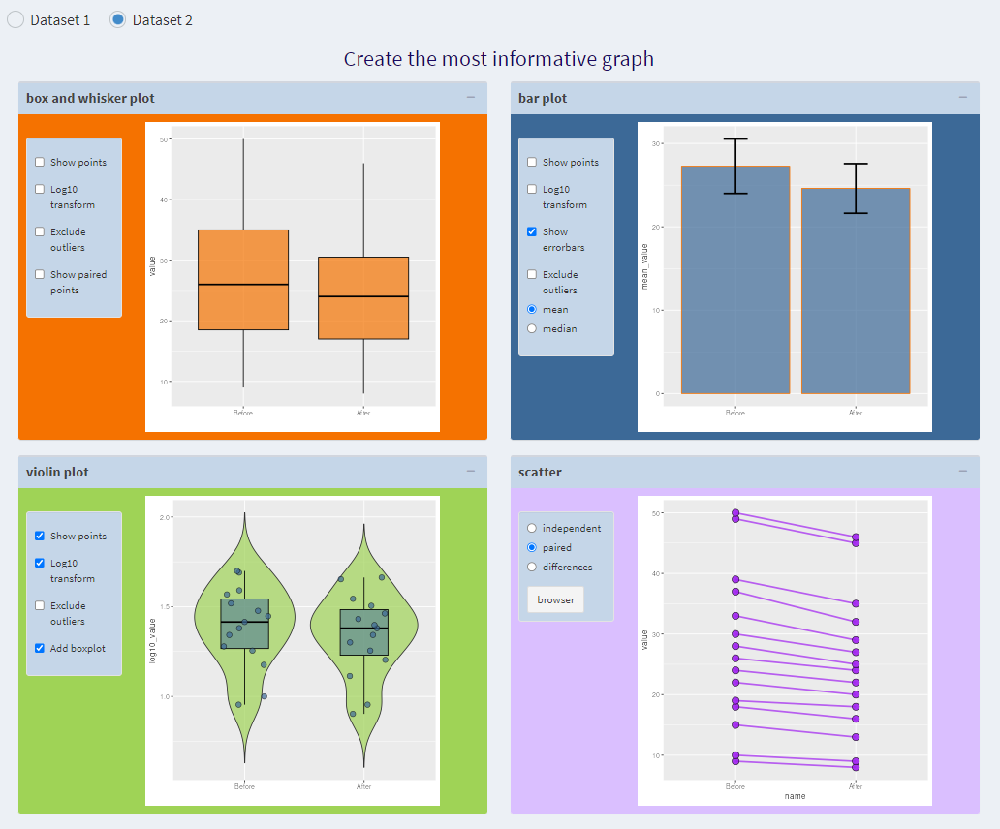
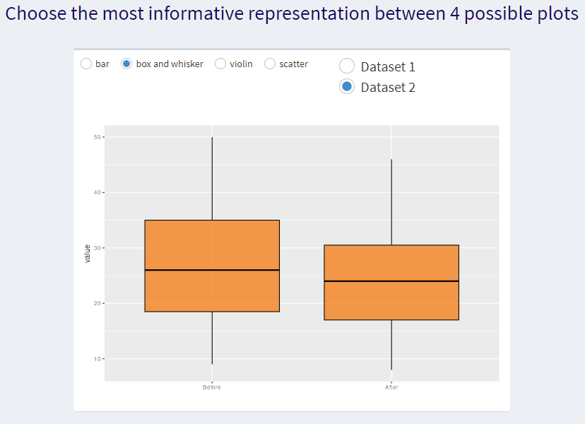

# Shiny app for use in research integrity course at Babraham

## Four plot app
                
                
Simple app to promote discussion around different ways of plotting the same dataset.   
Students can select various options on the different plots.
             
             

Hosted here: <https://www.bioinformatics.babraham.ac.uk/shiny/research_integrity/>
                
                
## One plot app
       
       
There is an additional, even simpler app in this repository that uses a lot of the same code.
         
         

It is hosted at a slightly different url: [https://www.bioinformatics.babraham.ac.uk/shiny/research_integrity1/](https://www.bioinformatics.babraham.ac.uk/shiny/research_integrity/)

To avoid duplicating the code, there is a two line app.R file on the Shiny server that points to the main repository.

`library(shiny)`

`shiny::shinyAppFile(appFile= "../research_integrity/one_plot_app.R")`
